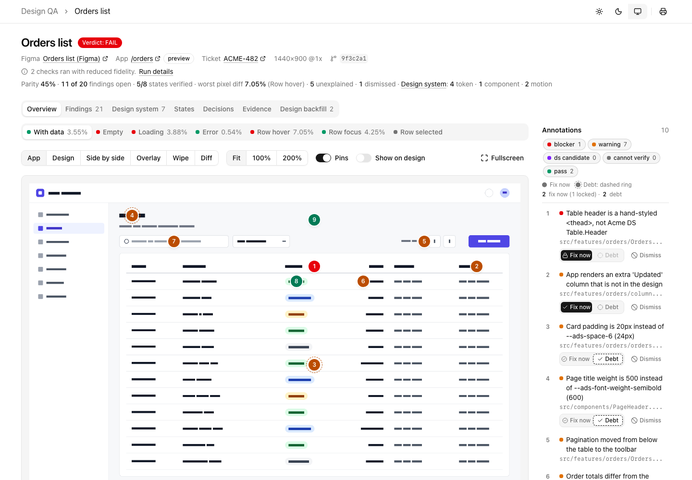

https://github.com/user-attachments/assets/367595d0-b955-4d2c-b9a6-209dfb3dddd8


# design-qa

Design → code parity QA, as an agent skill for Claude Code, OpenAI Codex and Cursor.

The contract is simple: **the design is the source of truth; it must be exact; only the data may differ; and nothing stays unexplained.** design-qa checks an implementation against its design across every screen and every state the design defines — with data, empty, loading, error, hover, focus, selected, disabled, and whatever else is there — not just the one happy-path screenshot most reviews catch. One direction only: it finds where the build diverges from the design, documents it and helps fix the code. The parity pass never asks the design to change; states the app has and the design lacks come back in a separate, later step (see [Two steps](#two-steps-parity-then-design-backfill)).

The design can be a Figma file, frame, page or section (one screen or many), a Figma prototype link, or a coded prototype URL (Figma Make, Framer, v0, Lovable, a static HTML page, localhost). Give it a design, a Jira ticket, and/or a target URL, in any combination, and one run produces two outputs: a report your tools and CI can act on, and a report a human can actually read. Design-system token mismatches, component mismatches and missing or different transitions and animations are called out on their own.

## How it works

**Defined design tokens must be used.** Colour, spacing, typography and other token contracts are checked separately from pixel similarity. Matching literals and unverified usage remain candidates; shared off-token values in the design do not clear implementation drift. The Design system tab shows verified token uses, deviations and checks whose usage still needs source verification.

A pass is a handful of commands. `pass.mjs` runs everything mechanical in a fixed order, and every stage ends with `Next: <command>`, runnable as printed, with anything the agent or the person must do first on `Do:` lines just above it. The agent's own judgment goes into one file, `findings.json`; the scripts build, check and render the report from it. That keeps different models, small and large, on the same path.

```
 pass.mjs start      setup check (tools, config, app reachable and signed in), at most
        |            4 questions on a first run, a report folder of its own (run lock)
        v
 the design          Figma: figma-fetch.mjs (FIGMA_TOKEN), or Figma MCP + figma-mcp-spec.mjs
        |            (no token); a coded prototype needs nothing here; ticket: Jira MCP or jira-fetch.mjs
        v
 pass.mjs evidence   every design frame mapped to a screen or state; every designed state
        |            captured over the whole page at its frame size; pixel diff; design-system
        |            audit of every element; a short worklist of the places that differ
        v
 findings.json       the agent decides each worklist item, audit candidate and compare row:
        |            a finding (pinned by a key or a selector) or a rejection with a reason
        v
 pass.mjs report     build-report.mjs -> report.json, earlier dismissals re-applied,
        |            render-report.mjs -> report.html + report-fixplan.md, validate.mjs
        v
 pass.mjs review     opens report.html: you choose fix now or later, dismiss with
        |            a reason, tick "Create tickets", click Send
        v
 apply-decisions.mjs -> fix loop on the fix-now set (evidence --recapture re-checks it),
        |              debt tickets if ticked, logs
        v
 pass.mjs finish     (in CI: pass.mjs gate turns the verdict into the job's result)
```

## What you get

- **`report.json`** — the full, agent-readable result: every screen, every state, every finding with its severity, evidence and location. Schema 2.0: [`skills/design-qa/schemas/report.schema.json`](skills/design-qa/schemas/report.schema.json).
- **`report-fixplan.md`** — what you chose to fix now, the rest as ticketed debt, a paste-to-agent block for each fix-now item so you can hand it straight to a coding agent, the design-system mismatches (tokens, components, motion) and what was dismissed and why.
- **Tickets and a debt log** — every diff you don't fix now becomes an entry in `qa-reports/design-debt.md` (and `.json`) and, when you tick "Create tickets", a ticket, so nothing is left unexplained. See [Review and send](#review-and-send-fix-now-later-or-dismiss).
- **Dismissals that stick** — any finding can be dismissed in one click ("not an issue", "remove from QA" or "accept as intentional") with a written reason. It is recorded in `report.json` and in `qa-reports/dismissed.md` (and `.json`), and later passes re-apply it instead of raising it again. See [Dismiss](#dismiss-not-an-issue).
- **`report-backfill.md`** — step 2: the states the app has and the design lacks, which ones to build in Figma, and a paste-to-design-agent block that builds them from the design-system library. See [Two steps](#two-steps-parity-then-design-backfill).
- **`report.html`** — a single-file interactive report for humans. The annotated capture is the page: the design and the app screenshot side by side, overlaid, wiped or diffed, per screen and state, with numbered pins on the capture coloured by severity that open each finding's detail with its design-versus-app crop. Below it: a "Choose what to fix" board, the fix-now list with copyable agent prompts, a Dismiss button on every finding, one review bar that sends all your decisions back to your agent, a Design system view (token, component and motion mismatches), collapsed debt and dismissed lists, a findings table with facet filters, state coverage and decisions. Styled on shadcn/ui (Neutral theme, Geist embedded under its OFL licence), implemented in plain CSS so the file opens offline with no network calls.

See a rendered example at [`examples/sample/report.html`](examples/sample/report.html), and a five-screen one at [`examples/mock-five-frames/report.html`](examples/mock-five-frames/report.html) (assembled by hand before the builder existed, so its page says "Not built by build-report.mjs").



## Install

The skill is one folder, `skills/design-qa/`, with a `SKILL.md`. Each agent loads skills from its own folders:

| Agent | Project folder | Personal folder |
|---|---|---|
| Claude Code | `.claude/skills/` (or install the plugin, below) | `~/.claude/skills/` |
| OpenAI Codex | `.agents/skills/` (in the working directory, its parents, or the repository root) | `~/.agents/skills/` |
| Cursor | `.agents/skills/` or `.cursor/skills/` (it also reads `.claude/skills/`) | `~/.agents/skills/` or `~/.cursor/skills/` |

Sources: [Claude Code skills](https://code.claude.com/docs/en/skills), [Codex skills](https://learn.chatgpt.com/docs/build-skills), [Cursor skills](https://cursor.com/docs/context/skills).

**Clone and install the script dependencies** once:

```bash
git clone https://github.com/NiavisDimitris/skills.git ~/design-qa-skill
cd ~/design-qa-skill/skills/design-qa
npm install
npx playwright install chromium
```

The skill folder carries its own `package.json` and lockfile. Capture and pixel diff need its packages (`playwright`, `pixelmatch`, `pngjs`); render, validate, triage, dismiss, review and apply need only Node 20+. Run `node scripts/doctor.mjs` inside the skill folder to check Node, packages and Chromium.

**Then link the skill into your agent's project folder.** Run these commands from your project root. A symlink keeps one copy, with dependencies installed inside that skill folder:

```bash
# Claude Code, project-scoped (personal: ~/.claude/skills/design-qa)
mkdir -p .claude/skills && ln -s ~/design-qa-skill/skills/design-qa .claude/skills/design-qa
# Codex, project-scoped (personal: ~/.agents/skills/design-qa)
mkdir -p .agents/skills && ln -s ~/design-qa-skill/skills/design-qa .agents/skills/design-qa
```

Claude Code and Codex document symlinked skill folders. Cursor reads `.agents/skills/` too, but its docs do not mention symlinks. If the skill does not show up, or to commit the skill into the project, copy it and install the dependencies inside the copy:

```bash
mkdir -p .cursor/skills
cp -r ~/design-qa-skill/skills/design-qa .cursor/skills/design-qa
(cd .cursor/skills/design-qa && npm install)
```

**Claude Code plugin**, as an alternative to the link:

```bash
claude plugin marketplace add NiavisDimitris/skills
claude plugin install design-qa@niavis-skills
```

This repo is its own plugin marketplace: the first command registers it under the name `niavis-skills` (see [`.claude-plugin/marketplace.json`](.claude-plugin/marketplace.json)); it is not listed in Anthropic's marketplace. The second installs the `design-qa` plugin, which is just the [`skills/design-qa`](skills/design-qa) folder (the examples, tests and docs stay out). Claude Code normally runs `npm install` for it, from the folder's own `package.json` and lockfile; if the packages are missing, the doctor below says so and prints the fix.

Capture needs Playwright's Chromium, a one-time download of about 100 MB that the plugin install does not do. On first use the skill runs `node scripts/doctor.mjs`, which checks Node, the packages and Chromium and prints the exact command for anything missing; it asks you before downloading the browser. To do it up front, run the doctor yourself from the installed skill folder (Claude Code keeps it under `~/.claude/plugins/cache/niavis-skills/design-qa/<version>/`):

```bash
node ~/.claude/plugins/cache/niavis-skills/design-qa/*/scripts/doctor.mjs
```

**Invoke it** with `/design-qa` in Claude Code, `$design-qa` in Codex, or `/` and the skill name in Cursor's Agent chat. All three also pick the skill on their own when you ask for design QA.

**What differs per agent: the review.** After an audit the agent opens `report.html` through `review.mjs` and waits while you decide. When you click **Send to agent**, Claude Code continues by itself: it is notified when the background command exits. In other agents, tell the agent you are done (for example "I sent my review"); it then applies `qa-reports/<slug>/decisions.json`. That works in every agent. Without the local server (a remote or cloud session, a CI artifact), use **Copy for your agent** and paste the message into the chat.

**To work on this repo** (tests, samples): `npm install && npx playwright install chromium` at the repo root.

## Quickstart

Invoke the skill with whatever you have on hand (shown with Claude Code's `/design-qa`; in Codex type `$design-qa`, in Cursor pick it with `/`):

```
/design-qa https://www.figma.com/design/<key>/...?node-id=1-23 --url http://localhost:3000/orders
/design-qa ACME-482
/design-qa orders --mode fix
/design-qa ACME-482 --url https://<preview>.vercel.app/orders --states empty,loading,error
/design-qa https://www.figma.com/proto/<key>/...?node-id=4-12 --url http://localhost:3000/checkout
/design-qa checkout --prototype https://checkout-proto.framer.website --url http://localhost:3000/checkout
```

A Jira ticket key alone (`ACME-482`) is often enough: the skill pulls Figma links, acceptance criteria and a preview URL from the ticket itself.

**No config to write first.** On the first run, `setup.mjs` reads the repository (the dev command and port, token files and themes in code, the component libraries the source imports, design docs), lists what it assumed, and asks at most four questions in one round, only those that change what a pass can find. `design-qa.config.json` is written only after you agree. An app behind sign-in gets `setup.mjs save-session`, asked in the same round as the other questions: a browser window opens and you sign in yourself; the agent never types or sees a password. Without a screen (SSH, a cloud session) it prints the command to run on your own computer, and `save-session --existing` records the session file you copy over. A set-up project gets no questions. A complete example config: [`examples/design-qa.config.example.json`](examples/design-qa.config.example.json).

**Modes:**

- `audit` (default): compare, report and open the review; no code changes until you click Send.
- `fix`: audit, let you choose what to fix now in the review, fix that set and re-verify; the rest becomes debt.
- `ci`: like audit, but non-interactive: no questions, exits with a verdict.

**Commands** on an existing report. You rarely need them: the review in `report.html` does the same in one step.

- `apply`: `/design-qa apply <slug>` applies the decisions you sent from the report (see [Review and send](#review-and-send-fix-now-later-or-dismiss)).
- `triage`: `/design-qa triage <slug> --fix DQ-001,DQ-004` applies your fix-now choice.
- `dismiss`: `/design-qa dismiss <slug>` records findings that are not an issue, with your reasons.
- `backfill`: `/design-qa backfill <slug>` builds the undesigned states' frames in Figma from the design-system library, after production matches the design (see [Two steps](#two-steps-parity-then-design-backfill)).

## What a pass guarantees

- **The whole page.** Every state is captured over its full scroll height and width: lazy content is scrolled into view, inner scroll panels (an app shell's main panel) are unrolled, and a page wider than the viewport is captured at its full width. A panel that unrolls into blank space or moves pinned chrome is put back, and an endless page is cut once it has grown by twice the frame's height; such a state is marked "captured in part". When the app page is taller, shorter, wider or narrower than the design, the part only one image has is not counted as differing pixels: it is a size difference with its own REVIEW reason. The report shows the whole page, with pins anywhere on it, and what was hidden or masked before the compare. The config's `capture.viewportOnly` opts out for a design that is about the first screen.
- **Every designed frame accounted for.** A Figma page or section is read as a whole: every top-level frame becomes a screen, a state, a breakpoint variant or an overlay, and the pass stops until any frame whose mapping is a judgement call is confirmed in a frame map. Each mapped frame gets a state row of its own (`Hover tile` is `hover-tile`, never folded into `hover`); two frames that would share an id stop the pass.
- **No result from nothing.** A pass that captured nothing (a sign-in page, no driver for any state), or where fewer than half of the designed states have a result, is `INCOMPLETE` unless something makes it `FAIL`; never a 100% match. A sign-in page is never saved as a state: on the first state captured it stops capture with exit 6; on a later one that state is marked and the evidence stage asks for a fix. A state counts as verified only with a design image and a pixel diff against it. The headline has two numbers and the coverage: `FAIL · match 91% · 4 of 27 findings settled · 8 of 9 states verified`. Match comes from the pixel diff: the share of each compared page that does not differ, or whose difference a settled finding or a rejection backed by a computed hint accounts for. Differences nobody decided, including those beyond the worklist's caps, count against it and hold the verdict at REVIEW. Findings settled is how many of the findings are fixed, signed off or otherwise no longer open. The verdict carries severity: a page can match 97% and still FAIL on a blocker.
- **Grounded, pinned findings.** Every open finding carries a pin on the capture; on a deployed target, findings come from the captured page, not from a local checkout. A difference the agent resolves as data counts only on a region with a computed data hint (or with a person's sign-off), never for a token, component, motion or state finding, and the verdict names it for a person to check. The validator rejects a report that breaks these rules.
- **Design-system audit.** Every rendered element is checked against your tokens (off-token values, near misses) and your component libraries (raw third-party or native controls where the design system has a component). A check that could not run reads "not checked", with the reason, never 0.
- **Run isolation.** Each pass gets its own report folder and run lock; writing into the folder of a run that is not finished needs that run's `--run` id. A busy folder gives the next run a sibling folder; an earlier pass is archived, never deleted, and a fresh pass inherits nothing but dismissals. Review servers are stopped by their own registration, never by pattern.

## Cost and model choice

The skill is built so a smaller, cheaper model can run it the same way a large one does, and so a run does not spend tokens on what a script can do:

- **Short instructions.** `SKILL.md` is a numbered procedure with one command per step. Reference files are read only when their "Read when" line applies; a normal pass reads two of them (the worklist and the findings guide), plus the onboarding guide on a first run.
- **Scripts do the sequencing.** `pass.mjs` decides the order, skips what is up to date, and prints one `Next:` line, so the agent never has to plan the pass or re-read long documentation to find the next step.
- **Small inputs to judge.** The agent reads `worklist.md` (at most 30 items by default, with computed hints and small side-by-side crops) and the one-line list `pass.mjs report --check` prints. It never opens a full-page screenshot or a raw evidence file; `inspect.mjs` answers a question about one element, on either side.
- **No arithmetic.** Pins come from a worklist key, an audit key or a selector; the build computes every box, id, rank and score.
- **Quick partial passes.** `--states <a,b>` captures only the states you name; the report then says the coverage is partial, and if they are fewer than half of the designed states the verdict is `INCOMPLETE`.

Measured: on the bundled five-screen mock (coded prototype, no sign-in), two cold runs by a Sonnet agent, given only the links, each finished a valid report in about 3 minutes, about 120,000 tokens and about 20 tool calls (17 and 22 commands). Both printed the same match (98%) and verdict (FAIL). They filed 18 and 13 findings for the same differences: one filed each wrong value separately, the other grouped them under two wrong-component findings. A finished pass on a Figma design or behind sign-in has not been measured on a real project.

## Two steps: parity, then design backfill

1. **Parity** — make sure production is built properly against the design. Design → code only: findings, fixes, triage, dismissals. States the design never drew are not part of it and never affect parity or the verdict; they are only listed, read-only, for step 2.
2. **Design backfill** — once production matches the design (`scorecard.loopClosed`), `/design-qa backfill <slug>` takes the states the app has and the design lacks (an empty state, a bulk-selection bar, an error toast), lets you choose which ones to build, and builds their frames in Figma next to the designed ones, from your design-system library only: library components in the right variant, bound variables and text styles, never raw hex or detached copies. Each frame is exported and pixel-diffed against the app capture. Missing library pieces are listed as DS gaps instead of improvised. Step 2 only adds frames; it never edits a designed frame to match code.

Choose on the report's Design backfill tab (sent with the rest of your review) or in chat; `report-backfill.md` has a paste-to-design-agent block. Building before step 1 is closed needs an explicit, recorded override. CI only lists candidates. Details: [`references/design-backfill.md`](skills/design-qa/references/design-backfill.md).

## Design sources

| You give | It reads |
|---|---|
| A Figma file, frame, page or section link | With `FIGMA_TOKEN`, the REST API (`figma-fetch.mjs`). Without a token, the Figma MCP: the agent saves `get_metadata` and `get_screenshot` results and `figma-mcp-spec.mjs` turns them into the same spec and 1x PNGs (it refuses a screenshot that is not exactly 1x). A page or section with several screens becomes a multi-screen pass (`<screen>/<state>` ids). `--url` is the route of the one screen it can be matched to; a screen with no route stops the evidence stage with the `screens` entry to write in `states.json`. |
| A Figma prototype link (`figma.com/proto/…`) | The same, starting from the prototype's node; the flow's frames are screens and states, its transitions are the expected motion. |
| A coded prototype (`--prototype <url>`): Figma Make, Framer, v0, Lovable, HTML, localhost | Captured with the same frame size and state drivers as the app (`capture.mjs --side design`), then compared element by element (`compare.mjs`): styles, tokens, components, motion, structure. Several screens: declare them in the pass's `states.json` (`screens`, with each one's prototype URL and app route). |

Details: [`references/prototype-source.md`](skills/design-qa/references/prototype-source.md).

## Review and send: fix now, later, or dismiss

You decide which diffs get fixed now. Everything else becomes debt with a log entry (and a ticket, if you want one), so every diff ends up fixed, signed off, dismissed, or tracked.

1. After an audit, the agent opens `report.html` in your browser (`review.mjs`) and waits. The recommended split is already set: the top findings and every blocker are Fix now, the rest Debt (fix later).
2. Move findings between Fix now and Debt, and dismiss the ones that are not an issue, with a reason (below). The review bar at the bottom counts it all: `Fix now 5 · Later 3 · Dismissed 2`.
3. Click **Review and send**. Add your name if you like, tick **Create tickets for the n later items** if you want tickets, and click **Send to agent**. Sending approves it: the agent records your decisions (`apply-decisions.mjs`), creates the tickets if you ticked the box, updates the debt log, and starts on the Fix now items. It still asks before risky or wide edits.
4. Claude Code continues as soon as you click Send. In other agents, tell the agent you are done.

The report opened as a plain file (a CI artifact, an attachment, a remote session) has **Copy for your agent** instead: it copies one plain-language message with your decisions and every Fix now finding in full. Paste it into any agent's chat; with the skill installed the agent applies it, and without it the message still says what to fix. **Download decisions.json** saves the same decisions as a file.

Blockers can't become debt: fix them, sign them off, or dismiss them with a reason. The pass is closed when nothing is left unexplained (`scorecard.loopClosed`). In CI, the default split is recorded, no tickets are created, and the proposed debt is listed in the PR comment.

Typing it by hand still works: `/design-qa triage <slug> --fix DQ-001,DQ-004` records the split, shows the debt tickets it would create and creates them after your yes, then fixes the fix-now set (`--no-fix` stops after the tickets).

## Dismiss: not an issue

Some findings are noise, duplicates, or not your team's to fix. Click **Dismiss** on the finding in `report.html`, pick *Not an issue*, *Remove from QA* or *Accept as intentional*, and write why. The reason is required. The dismissal goes to the agent with the rest of your review when you click Send. In chat, type it:

```
/design-qa dismiss ACME-482
DQ-004 not-an-issue — anti-aliasing on the icon edge; computed styles match
DQ-007 remove — shared header, owned by the platform team
by: A. Lee
```

Each dismissal is recorded in `report.json` (resolution `DISMISSED` with kind, reason, author and date, or `INTENTIONAL` with a sign-off) and in the cumulative `qa-reports/dismissed.md` / `.json`. Dismissed findings leave the counts. Every later pass re-applies them before ranking, so they are not raised again; if the difference itself changed, the finding comes back and the skill tells you.

## States

Only the design defines which states exist. Three places feed the state matrix, each with its own job:

1. **The design** — defines the states: variants, state-named frames, prototype reactions, and annotations on the frame; or the routes, toggles and interactions of a coded prototype.
2. **The ticket** — acceptance criteria add behaviour and motion checks to the designed states they mention (Jira today; see [Contributing](#contributing) to add another tracker). A state only the ticket names is not added.
3. **The drivers**: `qa-reports/<feature>/states.json` for one pass, or `surfaces.<name>.states` in the config, each with a driver that puts the app into a designed state: `fixture`, `query`, `mock`, `storage`, or `action` (see the example config for all five). The evidence stage suggests drivers for the states it could not reach, and stops until each has a driver or a recorded reason why it cannot be reached. With a Figma design, a `states.json` key (`<state>` or `<screen>/<state>`) that names no designed state stops it too, listing the designed ids. A configured state the design lacks is not added either.

The state coverage grid in the report classifies every designed state:

- **Missing in code** — designed, not implemented → blocker.
- **Unreachable** — designed and implemented, but the skill couldn't drive the app into it → reported as unverifiable, with the missing hook (fixture, mock route, selector, etc.) named.

A state that exists only in code, the ticket or the config is not part of the parity pass: it is listed for step 2, [design backfill](#two-steps-parity-then-design-backfill), which builds its frame in Figma once production matches the design. Anything extra the app renders inside a designed state is a finding against the code.

## Motion

Transitions and animations are part of the contract. The expected motion comes from Figma (`get_motion_context` through the MCP, or prototype reaction transitions: smart animate, dissolve, move in, slide, with duration and easing) or from the coded prototype's own CSS transitions and animations. The app's motion is read in every state (`motion/<state>.json`: computed `transition-*` / `animation-*` and `document.getAnimations()` right after each interaction). Motion that is missing or different — type, duration, easing, delay — is a finding in its own Motion ledger.

## Scripts

All under `skills/design-qa/scripts/`. An agent normally runs only `pass.mjs` and what its `Next:` lines name; every script has `--help`. The example paths are relative to the project root; when installed as a plugin the skill folder is elsewhere, and `node scripts/doctor.mjs` prints where.

| Script | Purpose |
|---|---|
| `pass.mjs` | Runs a pass in stages: `start`, `evidence`, `report`, `review`, `finish`, plus `status` (the single next command), `save-drivers` and `gate` (the CI result, read only from a report that validates). Each ends with `Do:` lines and a `Next:` command. |
| `setup.mjs` | `check`: what is ready, what is missing, and at most 4 questions. `apply`: writes the answers to `design-qa.config.json` (validated, atomic; refuses anything that looks like a secret). `save-session`: the person signs in in a browser window; the session is saved outside the repository. `export-theme`: turns a JS or TS theme into token JSON, only when the person agrees. |
| `run.mjs` | The run lock: a report folder per pass, a sibling folder when one is busy, earlier passes archived, never deleted. |
| `figma-fetch.mjs` | Reads a Figma link over REST (`FIGMA_TOKEN`): spec and 1x PNG per state; a page or section becomes a multi-screen pass. |
| `figma-mcp-spec.mjs` | The same spec from saved Figma MCP output, without a token; saves `get_screenshot` images after checking they are exactly 1x. |
| `jira-fetch.mjs` | Converts a saved Atlassian MCP issue (`--from-issue`) or fetches one over REST into `ticket.json`; creates debt tickets from a triaged report. |
| `capture.mjs` | Drives the app (or, with `--side design`, a coded prototype) with Playwright: screenshot over the whole page, computed styles, DOM, motion and a design-system audit file per state. `--probe` checks the target is reachable and signed in. |
| `diff.mjs` | Pixel-diffs the design image against the app capture; the part only one image has is reported as a size difference, not compared. A design image exported at another scale (2x, 1.5x, 0.75x) is refused. |
| `compare.mjs` | Compares a prototype capture with the app capture: style, token, component, motion and structure rows. |
| `ds-audit.mjs` | Checks every rendered element against the design system's tokens and component libraries. |
| `worklist.mjs` | Turns the comparison into a short list of the places that differ, with hints and side-by-side crops. |
| `inspect.mjs` | Answers one question about the evidence: what is at this place, on the app and in the design. |
| `build-report.mjs` | Builds `report.json` from `findings.json` and the evidence; checks that every worklist item, audit candidate and compare row is accounted for, and records a fingerprint that `validate.mjs` and the review check, so a hand-edited report is refused. |
| `render-report.mjs` | Renders `report.json` into `report.html`, `report-fixplan.md` and `report-backfill.md`. |
| `validate.mjs` | Validates a report, config, state matrix or decisions document. |
| `review.mjs` | Opens `report.html` on 127.0.0.1 with a one-time token and waits for Send; `--status` and `--stop` for its own server only. |
| `apply-decisions.mjs` | Applies the reviewer's decisions to `report.json` and the logs, and prints the fix-now list. |
| `triage.mjs`, `dismiss.mjs`, `debt-log.mjs` | Record a fix-now choice, a dismissal with its reason, and the cumulative debt log. |
| `backfill.mjs` | Step 2: undesigned-state candidates, decisions, the gate override and built Figma frames. |
| `doctor.mjs` | Checks Node, the packages and Playwright's Chromium, and prints the command for anything missing. |

App auth, when the target app needs it: `setup.mjs save-session` (you sign in yourself in a browser window; only the session file's path goes into the config), or environment variables in CI: `DESIGN_QA_APP_USER` / `DESIGN_QA_APP_PASS` / `DESIGN_QA_APP_COOKIE` / `DESIGN_QA_APP_STORAGE_STATE`. Never put credentials in `design-qa.config.json`: it is meant to be committed.

## CI

A ready-to-copy adopter workflow lives at [`examples/github-actions/design-qa.yml`](examples/github-actions/design-qa.yml); the full walkthrough is in [`skills/design-qa/references/ci.md`](skills/design-qa/references/ci.md).

It runs the skill headlessly against a PR's preview URL and fails the check on a `FAIL` verdict:

- any open **BLOCKER** finding,
- a designed state **missing in the implementation**,
- a pixel diff **above the review band** (`tolerances.pixelDiff.review` in the config) in a state with an unexplained finding, or with more than that share of the page left unexplained,

and on `INCOMPLETE` (nothing, or fewer than half of the designed states, captured and compared: a sign-in page, an unreachable target, missing drivers), which is never a pass. `pass.mjs gate` validates `report.json` against the evidence and `findings.json` before it reads the verdict, so a report edited by hand fails the check.

In CI the skill records the default triage, never creates tickets, and lists the proposed debt in the PR comment for a person to confirm.

Secrets the adopter sets: `ANTHROPIC_API_KEY`, `FIGMA_TOKEN`, `JIRA_BASE_URL`, `JIRA_EMAIL`, `JIRA_API_TOKEN`, and any of `DESIGN_QA_APP_USER`, `DESIGN_QA_APP_PASS`, `DESIGN_QA_APP_COOKIE` and `DESIGN_QA_APP_STORAGE_STATE_JSON` (a Playwright storageState JSON blob; the workflow writes it to a file) the target app needs. `GITHUB_TOKEN` is provided by Actions automatically. Give each secret the least privilege that works: the agent reads ticket, Figma and app text that other people write, and treats it as data, never as instructions.

The workflow skips pull requests from forks and from Dependabot (they get no secrets), pins its actions and the Claude Code CLI to exact versions, and keeps the report artifact for 7 days. On a public repository the PR comment and the artifact are public; read [Secrets in `ci.md`](skills/design-qa/references/ci.md#secrets) first, along with what to commit under `qa-reports/` (the dismissal and debt logs, not the evidence).

## How it stays honest

- One direction: the design is the reference; the code is what changes. Nothing in the parity pass asks the design to change; design backfill only adds frames for states the design never had, after the code matches.
- Captures run at the design frame's width, at device scale 1, over the whole page: no shrink-to-fit comparisons and nothing cut off below the fold. A coded prototype is captured at the same size as the app.
- Comparisons run on computed styles read from the live page, never eyeballed from a screenshot.
- Every visual claim traces back to a design token, or is named as a known exception — no "close enough."
- Every finding is classified against the config's severity and ledger, not left as a loose note. A dismissal always carries a written reason.
- Screenshots, diffs and computed values are persisted as evidence in the report, not summarized away.
- When a tool fails — Figma unreachable, ticket fetch fails, a state can't be reached — the report says so explicitly instead of skipping it silently.

## Project layout

```
.
├── .claude-plugin/
│   └── marketplace.json
├── skills/
│   └── design-qa/
│       ├── .claude-plugin/
│       │   └── plugin.json
│       ├── SKILL.md
│       ├── package.json
│       ├── references/
│       ├── scripts/
│       ├── templates/
│       └── schemas/
├── examples/
│   ├── design-qa.config.example.json
│   ├── github-actions/
│   │   └── design-qa.yml
│   ├── mock-five-frames/
│   └── sample/
├── docs/
│   └── report-preview.png
├── tests/
├── .github/workflows/ci.yml
├── package.json
├── CHANGELOG.md
├── CONTRIBUTING.md
├── LICENSE
└── README.md
```

## Roadmap

- Linear and GitHub Issues ticket adapters, alongside the existing Jira one.
- Auto-masked data regions in the diff view, so real (non-fixture) data doesn't produce noisy false positives.
- Sign-off merge-back — write a report's sign-offs and dismissals back to the ticket.
- Scroll-linked and script-driven motion capture.

## Contributing

See [`CONTRIBUTING.md`](CONTRIBUTING.md) — running tests, the zero-dep rule, no proprietary content, and how to add a ticket adapter or a state driver.

## License

[MIT](LICENSE) © 2026 Dimitris Niavis
